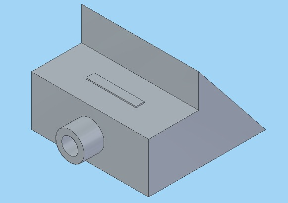

*Read this in other languages: [Portuguese](README.md).*

# WClarFYProject

## Conteúdo
1. [Project Description](#Project-Description)
1. [Project Images](#Project-Images)
1. [Project Details](#Project-Details)
1. [Built With](#Built-With)
1. [Sources](#Sources)
1. [Authors](#Authors)

## Project Description

 The Modular Metereologic Station MMS is a project that aims to offer a modular structure in which the user will be able to acquire its basic structure ready and its sensors separately as needed. The station may work with one or more sensors. The connective structure and the sensors are developed in open platforms and are available so that the users may produce them. The project was developed so that the costs are minimal and viable to everyone and even to low income people.

## Project Images

## Project Details
  The project has low cost automatized climate monitoring unities built from Arduino, Raspberry and ESP32/ESP8266 that send data through USB, Wifi or mobile devices through JSON for IBM Cloud and there they are processed by Deep Learning along with data from INPE and INMET generating a new metwreologic map.
  
## Built With
Arduino, Raspberry e ESP32/ESP8266. 

## Sources
  1. https://arduino.cc 
   
## Authors
  Victor Rosetti.
